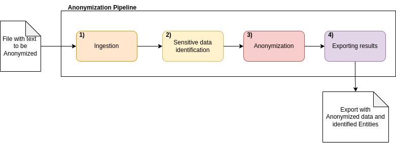
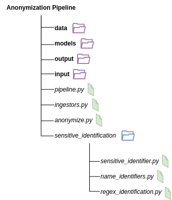

# Architecture of the Anonymization Pipeline

This document will serve as an overview of the architecture of the Anonymization Pipeline and its components. 

The purpose of the anonymization pipeline is to allow for the identification of spans which contain sensitive data that can be subject to GDPR laws and to provide methods for anonymizing such spans to reduce the risk of re-identification of subjects linked to the sensitive data. 

## Flow

The process of the anonymization depicted above is as follows:
1. The file that contains the text to be anonymized is first ingested by an ingestor that accepts it's format. 
2. Identification of sensitive spans of text is performed by *sensitive identifiers*, which are a combination of NER models and specific regex expressions. 
3. Sensitive spans can be anonymized (this is an optional step if the only purpose is to identify the sensitive data) with different techniques. 
4. Finally the texts with the identified spans can be exported in a  `jsonl` format that allows for analysis and easy manipulation of the data. 

## Structure

The following is a diagram of the structure of the project. 
The `output`, `input` and `data` directories are structure directories used for the organization of data and to mount specific directories to the Docker Container. 

The key components are the *Ingestors*, *Sensitive identifiers* and the *Anonymizers*. 

### Ingestors

These are in charge of 2 functions. 
1. Read the documents from the input file. 
2. Maintain the information of the identified sensitive spans (before and after anonymization). This includes:
    - Having a list of identified spans and manage conflicts
    - Allow for the substitution of the original data with anonymized data and updating the metadata of the spans. 

There are different ingestors for the different input formats. 

The span conflict is solved as using the following guideline:
- All spans are sorted in ascending order (by the start position). 
- If there is no overlap between the new span and the previous, the new span is added to the list. 
- If there is overlap between the new span and other spans the conflict is solved by merging the spans and asigning the label of the span with the highest ranking (attribute used for solving overlap conflicts). 

## Sensitive identifiers

Correct identification of the sensitive data is the most important step of the anonymization pipeline. 

There are 2 types of identifiers Regex identifiers (which can be customized) and NER identifiers (which can be either Spacy NER pipeline or Huggingface's RoBERTa models for NER). 

These tackle spans of different nature. Things that have a clear format and are always written in the same manner should be picked up by the Regex identifier. On the other hand, data which has no or less structure should be identified by the NER models (such as locations, names, miscellaneous data). 
Having said that, since conflicts are merged, it is a good practice to make NER models identify regular structures as well (just in case slight modifications are not captured by the regx expressions). 

## Anonymizer

The Anonymizers are classes that implement different anonymization techniques. 

The anonymization is performed when the data that can be used for the identification of the person is altered in such a way that it is not longer possible (or viable) to identify it. 

Depending on the purpose of the anonymization, the technique used has advantages and disadvantages. 

The techniques implemented are the following: 

- **Random anonymization**:  
    - *Procedure*: 
        - Sensitive spans are replaced by random strings in which each character is substituted for a random one of the "same nature" (i.e. numbers for numbers, letters for letters and capitalized chars for capitalized ones)
        - Symbols which are neither letters nor numbers are preserved (such as "@" and ":")
    - *When to use*:
        - This is a good method to maintain the "structure" of the text for future replacement and analysis of the writing style (capitalization, spaces, symbols). 
        - For sharing information is not the best since the anonymzied spans are too different from the original ones and missing identification is easy to spot. 
- **Label anonymization**:
    - *Procedure*:
        - Sensitive spans are replaced by placehoders with the name of the label inside (e.g. \<PER\>). 
    - *When to use*:
        - This technique is useful for analysing manually the text, since the identified spans are easy to identify at a glance. 
        - It suffers the same problem for sharing data that the random anonymization has (the things that are identified and the ones that are not identified are easy to distinguish). 
- **Intelligent anonymization**:
    - *Procedure*:
        - Sensitive spans are replaced so that they are "similar" to the original data in nature. 
        - Names and Surnames are replaced with random names from a gazetteer of the most common names in Catalunya. 
        - Locations are replaced by random locations from a Nomenclator for the Barcelona Metropolitan area. 
            - Words that indicate that a place is a park, street, avenue in Catalan and Spanish are used to guide the replacement. 
            - Numbers are detected to determine if the identified span is a full address or a more broad location. 
        - Phone numbers are replaced preserving the initial digit/s so that they belong to the same country. 
        - Other identified data is replaced with the random anonymization technique described above.
    - **When to use**:
        - This is the adviced method for sharing data since the replacement is "similar" in nature to the original data. 
        - It is the most secure method since the replaced data (of performed with the correct one) is almost undistinguishable from the data that was not correctly identified as sensitive. 
        - For internal use it is harder to see the replacement at a glance.
